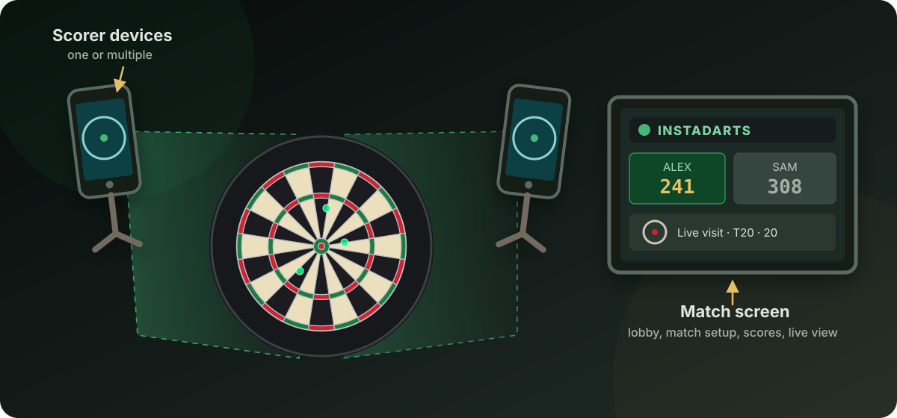
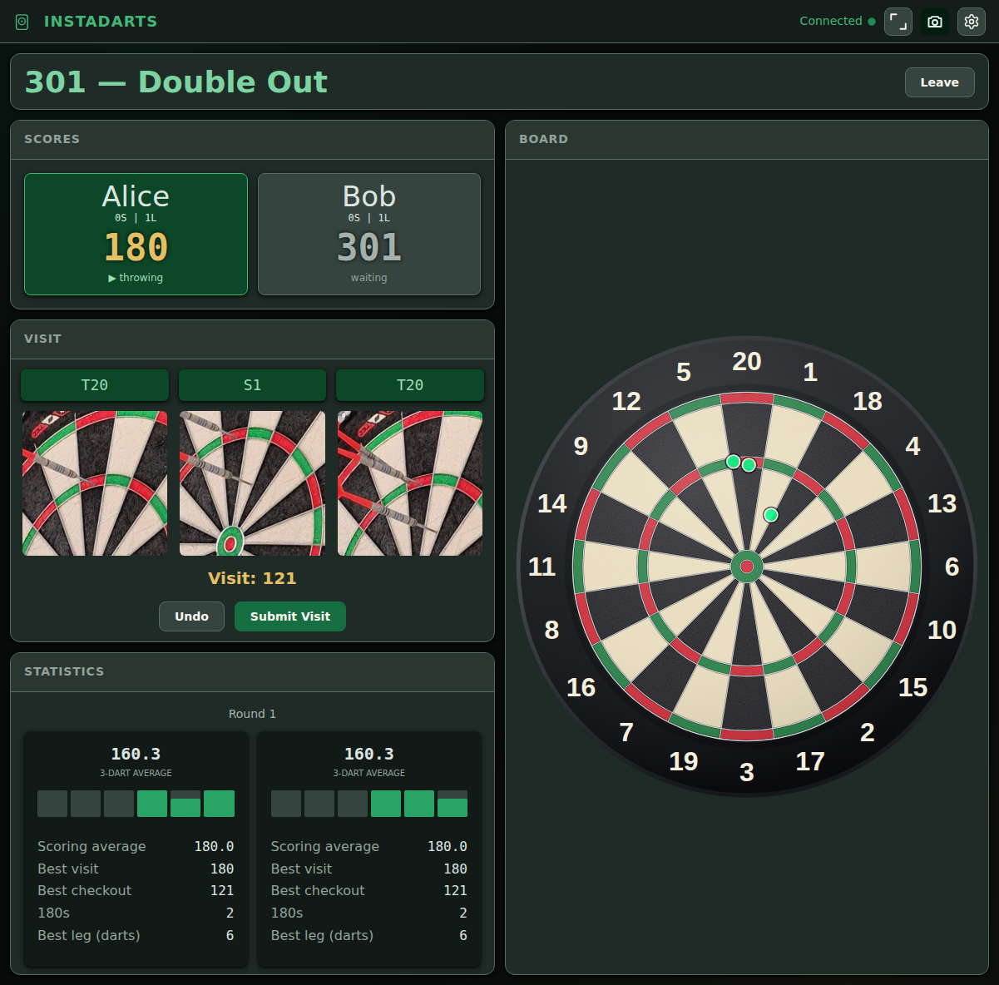
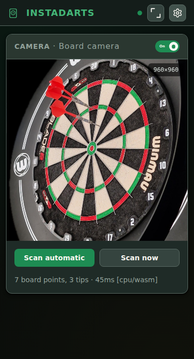
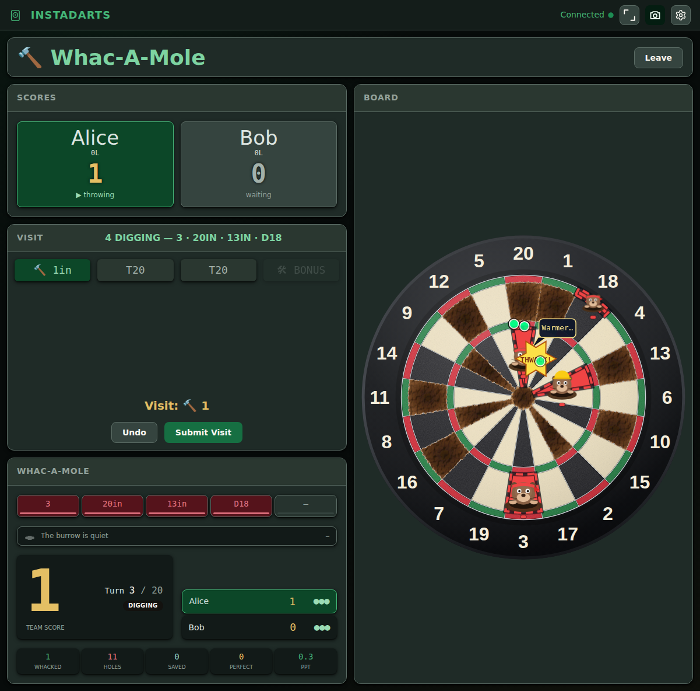
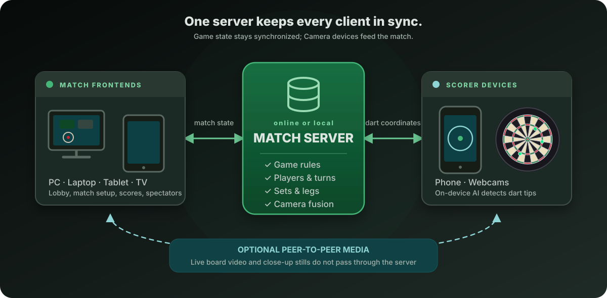

<div align="center">

# InstaDarts

**Open-source AI darts scoring using the hardware you already own.**

Turn an old phone into an AI-powered darts
scoring device. Play together in the same room or invite others to join remotely—no accounts
required.

[Try the live demo][demo] · [Set up your first game](#your-first-game) · [Run your own server](#run-your-own-server)

</div>



> **Transparency:** Most of the server and frontend was implemented with the help of large language
> models (LLMs). The AI model, scoring pipeline, and stack architecture were designed manually.
> The training data was collected and labeled by hand.

## Your first game

All you need is a phone with a camera and a modern browser, plus a second device with a larger
screen, such as a laptop, tablet, or PC.

1. Open the [hosted demo][demo] or your [own server](#run-your-own-server) on the screen you will use
   for the match.
2. Select **Pair a Scoring Device**. Scan the QR code with the phone that will watch the board.
3. Follow the four short steps on the phone: give it a name, choose its camera, let InstaDarts test
   the device, and aim it at the board. Allow camera access when the browser asks.
4. Place the phone to either side of the board and above or below the bull, then point it at the
   dartboard. Use the zoom slider until the board fills the camera preview. Leave enough distance
   between the board and the phone to protect it from stray throws and bounce-outs.
5. Back on the main screen, choose **Local Match** or **Online Match**, add players, select a game
   mode and match format, then press **Start Match**.
6. Throw. Detected darts appear in the current visit. Remove the darts after the visit and the game advances automatically; **Undo** and correct before removing darts from the board if necessary.

For an online match, the host shares the invite code or link shown in the lobby.

## Screenshots

### A 501 match in progress



### The scoring device

<p align="center">
  
</p>

### A Whac-A-Mole match in progress



## Included game modes

The software architecture is deliberately designed to make new game modes easy to add. The two
included modes demonstrate what is possible, and more will be added. Every match can be played over
multiple sets and legs.

### x01

The classic countdown game: 301, 501, or 701, with optional double-in, double-out, and match
statistics.

### Whac-A-Mole

A cooperative accuracy game built for practice and group play. Chase your high score as moles appear
in specific areas of the board, and whack them before they finish digging their holes. Don't lose your
darts, or the janitor will get mad at you.

## How the stack fits together



The match server is the single source of truth for game rules, players, turns, sets, legs, and camera
fusion. The frontends are synchronized views and controls; scorer devices focus on detecting dart
tips. This separation keeps every screen consistent and makes new game modes easy to add.

## Run your own server

InstaDarts is distributed as source code. Download the **Source code (zip)** from the
[latest GitHub Release](../../releases/latest), extract it, and open a terminal in the extracted
folder. Then run:

```sh
npm install
npm run build
npm start
```

The server prints network addresses that you can open on other devices, similar to these:

```text
http://192.168.1.20:3000
https://192.168.1.20:3001
```

Open one of the printed network addresses instead of `localhost`, even on the main screen. Pairing
and invitation links will then work on every device connected to the same network. Stop the server
with <kbd>Ctrl</kbd> + <kbd>C</kbd>.

This is enough to play on a local network. To invite players over the internet, the server must be
reachable at a public HTTPS address.

### Why the camera address uses HTTPS

Browsers only allow camera access from a secure page. Use the printed **HTTPS** address on scoring
devices. With the default settings, InstaDarts creates its own local certificate. Each device will
show a security warning the first time because that certificate is not trusted by a public
certificate authority. Check that the address belongs to your server, accept the warning once, and
the browser can use the camera.

A hosted instance or reverse proxy can use a publicly trusted certificate instead. HTTP and HTTPS
ports, certificates, capacity, media, and scorer behavior can all be changed in the optional
`instadarts.config.jsonc` settings file. The
[`instadarts.config.example.jsonc`](instadarts.config.example.jsonc) example lists every setting and
its default value; the defaults work without creating a file.

## Add your own game idea

InstaDarts already supplies the difficult shared pieces: lobbies, invitations, players, turn order,
sets and legs, reconnects, spectators, camera input, validation, responsive screens, and match
summaries. For a new game mode, you normally need to supply only its settings, rules, and display
values.

A straightforward mode is one TypeScript file plus one registry line. The lobby builds its settings
form automatically, and the standard match screen can render scores and statistics without custom
frontend work. When an idea needs a distinctive presentation, an optional React panel can take over
that part of the screen while the rest of the framework stays unchanged.

This narrow, documented boundary also works well with LLM and agentic coding tools. For example:

> Add an “Around the Clock” mode to InstaDarts. Follow `docs/game-modes.md` and the existing modes,
> expose its options through the standard settings fields, keep its rules on the server, and add
> tests for winning, misses, undo, and multiple players.

Review and test generated changes like any other contribution, then rebuild and restart the server.
The [game-mode guide](docs/game-modes.md#installing-and-removing-a-game-mode) explains the concise
contract and includes a complete example.

## Project links

This README is deliberately focused on playing and hosting. If you want to edit or contribute to
InstaDarts, start with [CONTRIBUTING.md](CONTRIBUTING.md) and the compact
[developer documentation index](docs/README.md).

## License

InstaDarts is free and open-source software licensed under the
[GNU Affero General Public License v3.0 only](LICENSE). Third-party notices are generated with each
production build and are also available from **Settings → Third-party notices** in the running app.

[demo]: https://instadarts.com
